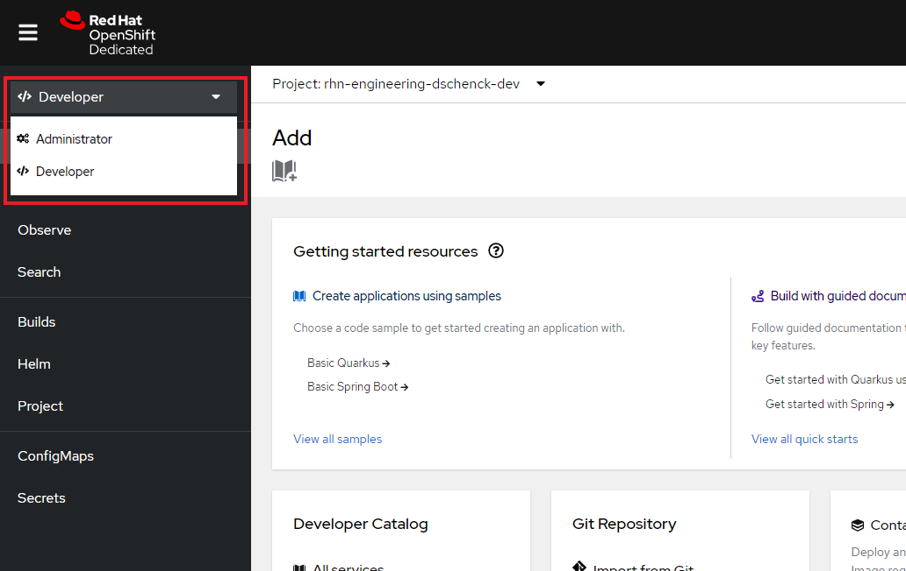
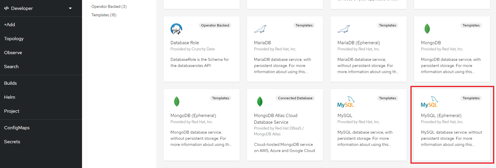
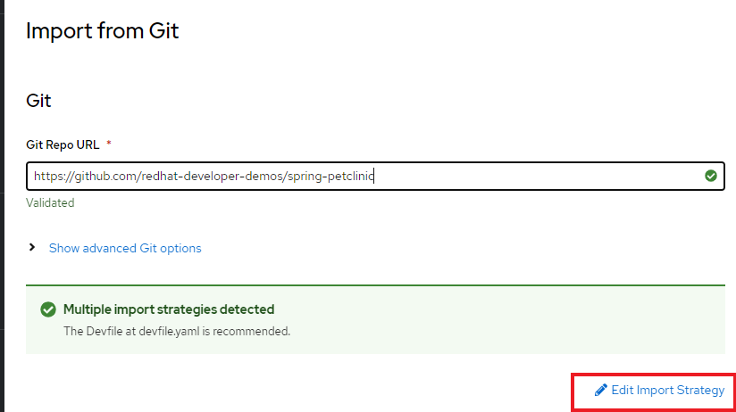
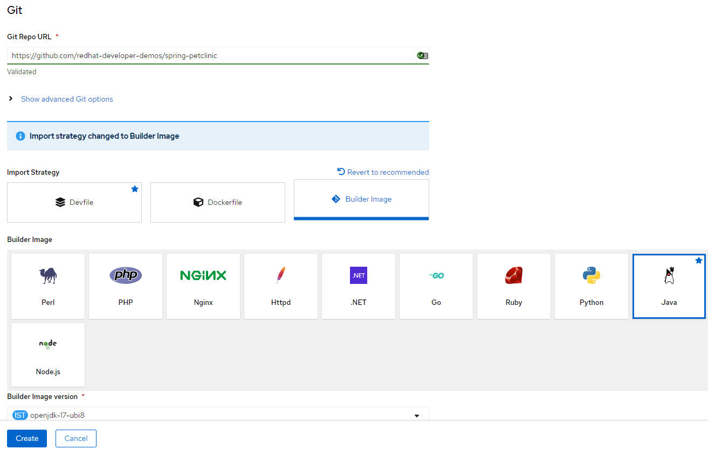
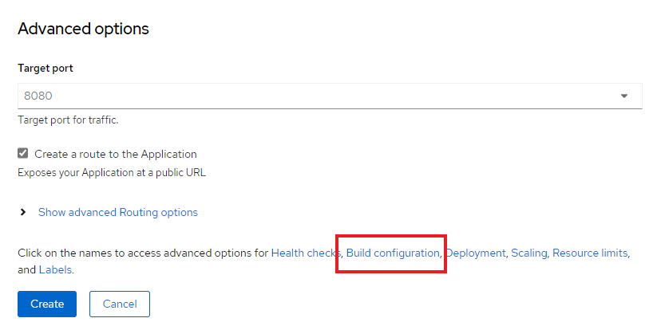
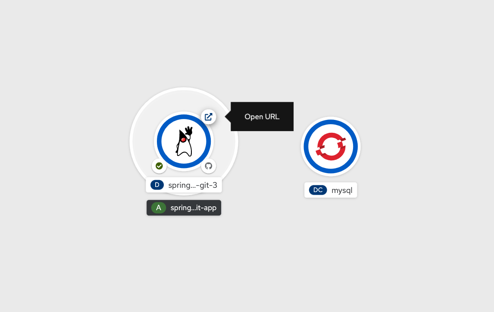
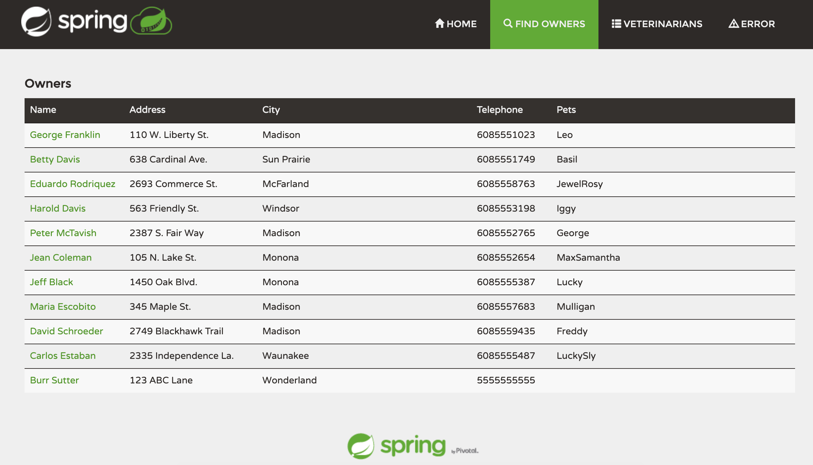
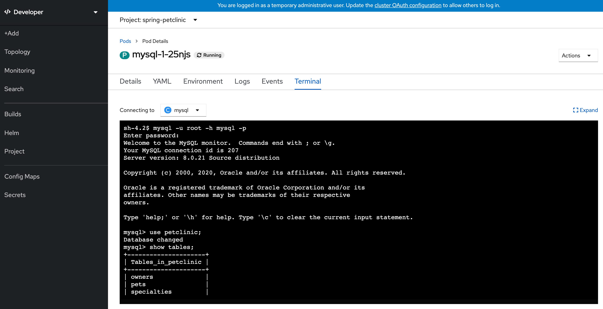
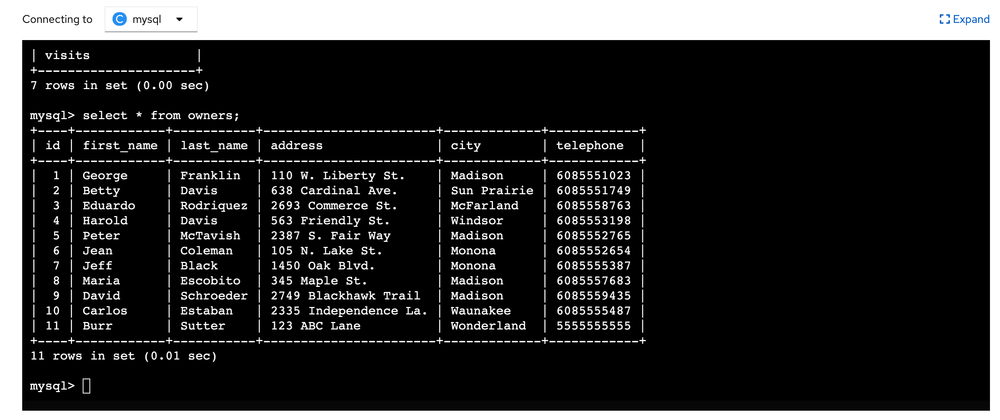

# Spring Pet Clinic on ARO

This repo contains a container-ready implementation of the iconic Spring Petclinic application. Specifically, this code is useful with the OpenShift Source-to-Image (s2i) technology and is part of the introductory material for [Developer Sandbox for Red Hat OpenShift](https://developers.redhat.com/developer-sandbox).

## OpenShift Implementation
Get your *free*  OpenShift cluster to run this demo. You can get free access to Developer Sandbox for Red Hat OpenShift at: https://developers.redhat.com/developer-sandbox


### Dev Console

Make sure you are in the Developer perspective:

  

Create a new MySQL instance by clicking the `+Add` button and choosing the `Database` option:


This will display the Developer Catalog. Choose MySQL Ephemeral:

  

and Click `Instantiate Template`.

Then fill the wizard with the following parameters. Note that your Namespace will not match the one shown here, and that *does not* matter. To summarize this screen capture, here is a list of the values you need to change or supply:

* MySQL Connection Username: **petclinic**
* MySQL Connection Password: **petclinic**
* MySQL root user Password: **petclinic**
* MySQL Database Name: **petclinic**


Click the `Create` button. 

We are using the **Ephemeral** implementation because this a short-lived demo and we do not need to retain the data. In an Ephemeral instance, the data lives inside the pod, meaning the data is destroyed when the pod is destroyed.  

In a production system, you will most likely be using a permanent MySQL instance. This stores the data in a Persistent Volume (basically a virtual hard drive), meaning the MySQL pod can be destroyed and replaced with the data remaining intact.

After a few minutes, and behind the scenes, an Ephemeral instance of a MySQL database container will be started. At this point, you have a database engine to be used by the application. Time to move on and create the application.

### Deploy Pet Clinic App


Click the `+Add` button and choose `Import from Git` type:

Fill the git repo with the following value `https://github.com/redhat-developer-demos/spring-petclinic`. This is where things get interesting.

When you enter the URL for a git repo, OpenShift will look at the files in the repo and attempt to discern the best way to build the application. There are three possible results:  
1. Build using the file "devfile.yaml" found in the source code
1. Build using the file "dockerfile" found in the source code
1. If neither of the above two files are found, build using a builder image and the built-in source-to-image (s2i) technology. This is the focus of this article.

If, the case of this example (i.e. Spring Petclinic), OpenShift does **not** choose the builder image option, you will need to direct it to do so. Here's how to do that:

First, click on the "Edit Import Strategy" link:

  

Next, choose the Builder Image option and make sure the Java builder is selected:



Near the bottom of the page, click the `Build Configuration` link:



Add the following environment variables, as displayed in the following screen capture:

```
SPRING_PROFILES_ACTIVE=mysql
MYSQL_URL=jdbc:mysql://mysql:3306/petclinic
```


Finally click the `Create` button and wait until the Build is done and the Pod is up and running (dark blue around the deployment bubble). In testing this using the Developer Sandbox for Red Hat OpenShift, this step took approximately six minutes. Please note: You *may* see error messages in the Sandbox. They are temporary while the application builds.  

Then push the Open URL button to view the Pet Clinic app:






And if you visit the MySQL deployment's Terminal then you connect to the database to see the schema and data


```
mysql -u root -h mysql -p

petclinic

use petclinic;
show tables;
```



```
select * from owners;
```


`### End ###`
